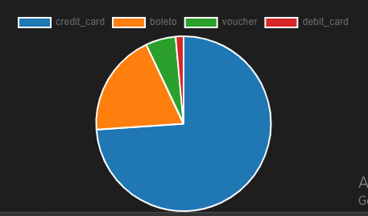
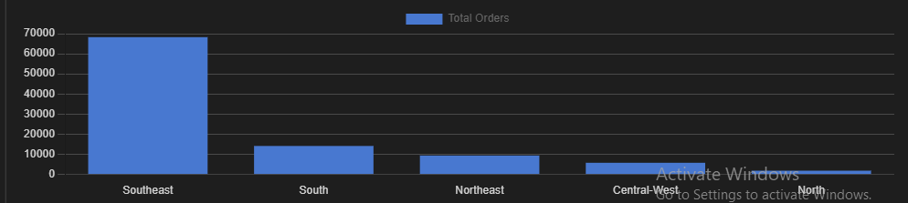
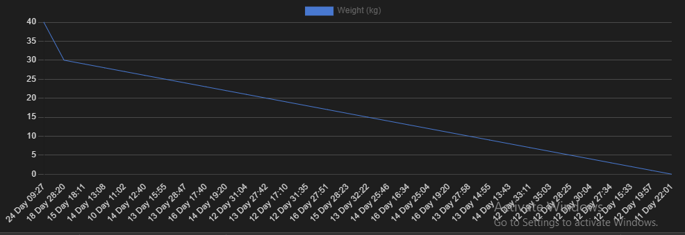

# Brazilian E-Commerce Public Dataset Analysis

### SQL Business Intelligence Project (Handling 1M+ Records)

## 📌 Project Overview

This project features a comprehensive end-to-end analysis of the **Brazilian E-Commerce Public Dataset** using **PostgreSQL**. The primary focus was transforming raw, large-scale data into high-level business intelligence.

## 📂 Data Scale & Source

* **Data Volume:** Analyzed a production-scale database with **1,000,000+ rows**.
* **Source:** [Kaggle - Olist Brazilian E-Commerce Dataset](https://www.kaggle.com/datasets/olistbr/brazilian-ecommerce)
* **Technical Note:** Raw CSV files are not hosted here due to GitHub's 25MB limit.

---

## 📊 1. Total Platform Revenue

Calculating the "North Star" metric to understand the total financial scale of the marketplace.

```sql
SELECT to_char(sum(payment_value) / 1000000.0, 'FM999,999.00')
as "Total Revenue (in Millions)" 
FROM order_payments;

```

---

## 🛍️ 2. Revenue by Product Category

Identifying which product categories are the primary drivers of sales volume.

```sql
SELECT 
    r.product_category_name_english AS "Product Category",
    to_char((SUM(q.price + q.freight_value) / 1000), 'FM9,999,999.0') AS "Total Revenue (in K)"
FROM products p
INNER JOIN order_items q ON p.product_id = q.product_id
INNER JOIN product_category_name_translation r ON r.product_category_name = p.product_category_name
GROUP BY 1 
ORDER BY SUM(q.price + q.freight_value) DESC;

```

---

## 💳 3. Payment Method Distribution

Analyzing how customers prefer to pay to optimize checkout financial flows.

```sql
SELECT 
    payment_type AS "Payment Type", 
    count(payment_type) AS "Total Transactions"
FROM order_payments
GROUP BY payment_type
ORDER BY "Total Transactions" DESC;

```



---

## 🏆 4. Top 10 High-Value Customers

Isolating "Power Users" or "Whale" customers based on their total historical spend.

```sql
SELECT 
    a.customer_id as "Customer ID",
    to_char(c.payment_value, 'FM99,999.0') as "Total Purchase Value (R$)"
FROM customers a
JOIN orders b ON a.customer_id = b.customer_id
JOIN order_payments c ON b.order_id = c.order_id
ORDER BY c.payment_value DESC
LIMIT 10;

```

---

## ⭐ 5. Average Order Rating

Measuring overall customer sentiment and platform health through review scores.

```sql
SELECT round(avg (review_score ::INT),2) as "Avg Order Rating" 
FROM order_reviews;

```

---

## ⏱️ 6. Review Response Latency

Calculating the time gap between a customer leaving a review and the system processing it.

```sql
SELECT 
    TO_CHAR(
        JUSTIFY_INTERVAL(AVG(review_answer_timestamp - review_creation_date)), 
        'DD "days" HH24:MI'
    ) AS "Avg. Review Time"
FROM order_reviews;

```

---

## 🚚 7. Regional Order Volume

Grouping 27 Brazilian states into 5 macro-regions to visualize geographical density.

```sql
SELECT 
    CASE 
        WHEN a.customer_state IN ('SP', 'RJ', 'MG', 'ES') THEN 'Southeast'
        WHEN a.customer_state IN ('PR', 'SC', 'RS') THEN 'South'
        WHEN a.customer_state IN ('MT', 'MS', 'GO', 'DF') THEN 'Central-West'
        WHEN a.customer_state IN ('BA', 'PE', 'CE', 'RN', 'PB', 'AL', 'SE', 'MA', 'PI') THEN 'Northeast'
        WHEN a.customer_state IN ('AM', 'RR', 'AP', 'PA', 'TO', 'RO', 'AC') THEN 'North'
        ELSE 'Unknown'
    END AS "Region",
    COUNT(b.order_id) AS "Total Orders"
FROM customers a
JOIN orders b ON a.customer_id = b.customer_id
GROUP BY 1
ORDER BY 2 DESC;

```



---

## 📦 8. Delivery Time vs. Product Weight

Investigating if shipping logistics are significantly delayed by the physical weight of items.

```sql
SELECT DISTINCT ROUND(a.product_weight_g / 1000) AS "Weight (kg)",
TO_CHAR(AVG(b.order_delivered_customer_date - b.order_purchase_timestamp), 
'DD "Day" HH24:MI') AS "Delivery Time"
FROM products a
INNER JOIN order_items c ON a.product_id = c.product_id
INNER JOIN orders b ON b.order_id = c.order_id
WHERE a.product_weight_g IS NOT NULL
GROUP BY 1
ORDER BY 1 DESC;

```



---

## 🛠️ Technical Skills Demonstrated

* **Database Management:** PostgreSQL / pgAdmin 4
* **Aggregation:** `SUM`, `AVG`, `COUNT`, `ROUND`
* **Logic:** `CASE` Statements, Data Type Casting (`::INT`)
* **Joins:** Advanced `INNER JOIN` logic across multiple tables

---

## 📬 Contact

**GitHub:** [aamirmailbox7](https://www.google.com/search?q=https://github.com/aamirmailbox7)

**LinkedIn:** https://www.linkedin.com/in/mohammad-amir-b93a26397/
